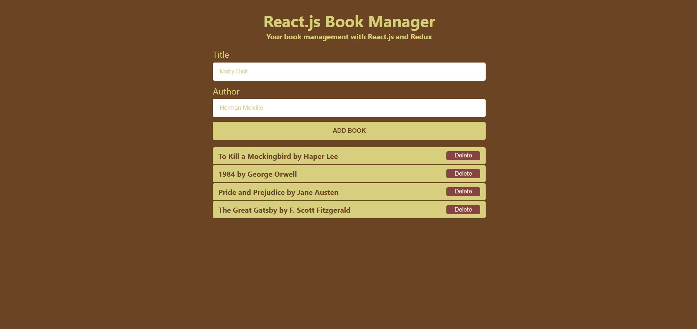

# React.js Book Manager

A book management application built using React.js and Redux.

## Table of Contents

- [Description](#description)
- [Features](#features)
- [Technologies](#technologies)
- [Screenshots](#screenshots)
- [Setup](#setup)
- [Contact](#contact)

## Description

React.js Book Manager is a simple and efficient application for managing your book collection. You can add and delete books with ease using this application.

## Features

- Add books
- Delete books

## Technologies

- React.js
- HTML
- CSS
- JavaScript
- Redux

## Screenshots



## Setup

To run this project, install it locally using npm:

```bash
# Clone the repository
git clone https://github.com/jordanwmp/react-reduce-book-manager.git

# Navigate to the project directory
cd react-reduce-book-manager

# Install dependencies
npm install

# Start the development server
npm start
